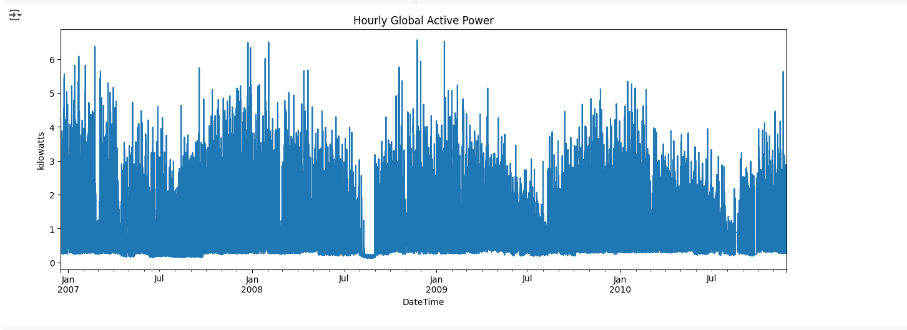
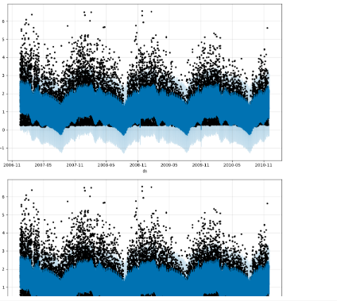
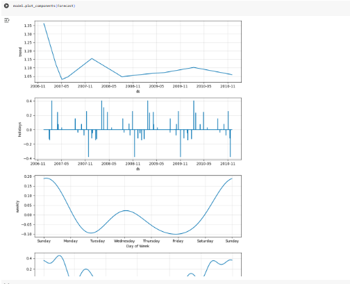

# Individual Household Electric Power Consumption Analysis
This project analyzes and forecasts household power consumption using hourly data. It includes data resampling, visualization, and future forecasting using Facebook Prophet.
## File
individual_household_electric_power_consumption.py`: Python script with data preprocessing, hourly resampling, Prophet forecasting, and error evaluation.
## Features
- Load zipped power consumption dataset from Google Drive
- Combine date and time into a single datetime column
- Convert to hourly time series and handle missing data
- Visualize active power usage over time
- Forecast future consumption using **Facebook Prophet**
- Evaluate predictions using:
  - RMSE
  - MAE
## Visualizations
### Hourly Global Active Power

### Forecasted Power Consumption

### Forecast Components (Trend, Seasonality, Holidays)

## Tools Used
- Python
- Pandas, NumPy
- Matplotlib
- Facebook Prophet
## Insights
- Daily and weekly consumption trends were observed
- Prophet generated accurate hourly forecasts with reasonable RMSE and MAE
- Indian holidays were added to improve model accuracy

